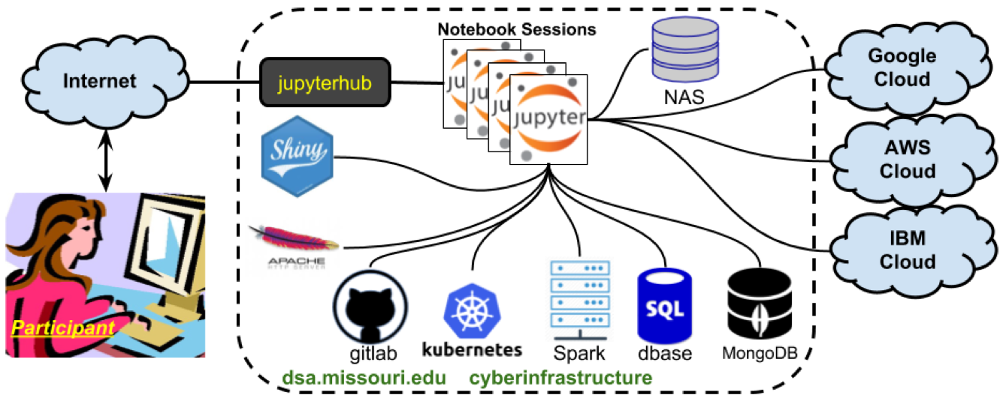

```{r setup, include=FALSE}
knitr::opts_chunk$set(
  echo = TRUE,
  eval = FALSE,
  collapse = TRUE,
  comment = "#>"
)
options(htmltools.dir.version = FALSE)
htmltools::tagList(rmarkdown::html_dependency_font_awesome())

## load libraries, set ggplot2 theme, and create datatable function
#library(kmw)
library(ggplot2)
theme_set(dataviz::theme_mwk(base_size = 14))
set.seed(20180911)
print <- function(x, n = NULL, align = "c", digits = 3) {
  if (is.null(n)) n <- nrow(x)
  if (nrow(x) < n) n <- nrow(x)
  cat(paste(knitr::kable(x[seq_len(n), ], format = "markdown", 
    align = align, digits = digits), collapse = "\n"))
}
```

# Michael Kearney, Ph.D.

+ Assistant Professor with joint appointment in
  - School of Journalism
  - Informatics Institute
* MU DSA program faculty
  - Chair of Curriculum Committee
* Research and teaching
  - Social media / text & network analysis
  - Twitter, political media diets, "fake news"

---

# MU - DSA
* 21 Month Program
* 34 Credit Hours
  - 19 hours **Data Science Core** courses
  - 3 hours **Case Study**
  - 9 hours **Emphasis Area** (elective) courses
  - 3 hours **Capstone**

---

# Fall 2019 Classes
* Introduction to Data Science and Analytics 
  - August 19 – October 13
* Statistical and Mathematical Foundations of Data Analytics
  - September 16 – November 10
* Database and Analytics
  - October 14 – December 13
---

# Spring 2020 Classes
* Big Data Visualization
* Applied Machine Learning
* Big Data Security


---

# Program Emphasis

*Summer Case Study
  - Group project for exploratory computational data analysis
* Emphasis area classes
  - Biotechnology, Human-Center Design for Data, etc.
* Capstone Project
  - Group project, significant project with exploration and predictive analytics

---

# Learning Technologies

Course work leverages three systems:

* Canvas Learning Management System (LMS)
  - Discussion Forums, Videos, Grade book
* JupyterHub
  - Interactive learning activities (programming)
* Discussion Boards
  – Mutual Aid and Learning Support


---

# JupyterHub



---
class: inverse, center, middle

# Questions?

Website: dsa.missouri.edu

Email: DSAMasters@missouri.edu


